# Claude Code Status Line

One line under the Claude Code prompt: the model, how much context is left, the git
branch, the session diff, the project name. Single Python file, no dependencies.


<p align="center">
  <picture>
    <source media="(prefers-color-scheme: dark)" srcset="docs/statusline-dark.svg">
    
  </picture>
</p>

```text
Haiku 4.5 │ ██████░░░░ 68% free │ ⎇ feat/status-line* │ +312 -88 │ 64k/200k │ my-project
```

Write-up: [pavolmiklas.com/blog/status-line](https://pavolmiklas.com/blog/status-line)

## Install

Save the script:

```bash
curl -fsSL https://raw.githubusercontent.com/PaloMiklo/status-line/main/statusline.py \
  -o ~/.claude/statusline.py
```

Add to `~/.claude/settings.json`:

```json
{
  "statusLine": {
    "type": "command",
    "command": "python3 ~/.claude/statusline.py"
  }
}
```

Start a new session. On Windows use `python %USERPROFILE%\\.claude\\statusline.py`.

## Segments

| Segment | Example | Meaning |
|---|---|---|
| Model | `Haiku 4.5` | Model answering, from `model.display_name`. |
| Context left | `■■■■■■□□□□ 68% free` | Headroom before auto-compact. |
| Branch | `⎇ feat/status-line*` | Git branch. `*` means the working tree is dirty. |
| Churn | `+312 -88` | Lines added and removed this session. |
| Tokens | `64k/200k` | Context used against the window. |
| Project | `my-project` | Project directory name. |

Segments that do not apply are omitted. Outside a git repository the branch disappears.

## How it works

Claude Code pipes a JSON snapshot of the session to stdin on every render, and whatever
the command prints to stdout becomes the line.

Two details are worth knowing if you fork it:

**Token count.** The script walks the transcript backwards to the newest entry carrying a
`usage` object, then adds `input_tokens`, `cache_read_input_tokens` and
`cache_creation_input_tokens`. That entry already holds the running total, because every
turn re-counts the cached prefix it read. Summing all lines inflates the number badly.

**Context limit.** 200k, unless the model id contains `[1m]` or the payload sets
`exceeds_200k_tokens`. Two independent signals for the same fact, so the bar stays correct
when a session is upgraded mid-flight.

It also never raises and never blocks. A bad payload prints `Claude Code` instead of a
traceback, and every `git` call carries a 250 ms timeout.

## Customise

Constants at the top of the file:

```python
SEP   = " │ "
BAR_W = 10
FULL, EMPTY = "█", "░"
```

Add a segment by appending to `parts` in `main()`. The separator is applied on join.

If your terminal font lacks `█ ░ │ ⎇`, swap those for ASCII.

## License

[MIT](LICENSE)
